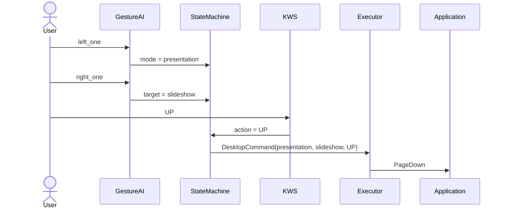
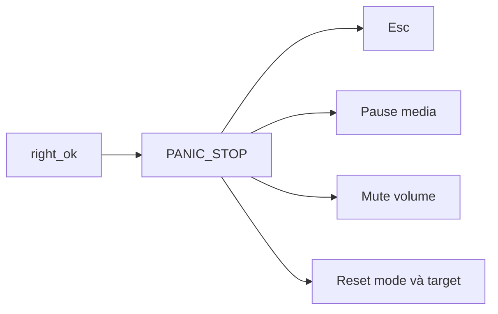

# Mapping tổ hợp Gesture + KWS

## 1. Cách tạo một lệnh hoàn chỉnh

Từ Phase 5, gesture và KWS không điều khiển ứng dụng độc lập. State Machine giữ
hai lựa chọn từ gesture, sau đó ghép keyword thành một command duy nhất:

```text
Gesture tay trái + Gesture tay phải + KWS
 [ mode          +     target       + action ]
                    |
                    ↓
          DesktopCommand(mode, target, action)
                    |
                    ↓
             Phím tắt hoặc Windows API
```

Ba input được thực hiện **tuần tự**, không cần xuất hiện đồng thời. 

Ví dụ:

```text
left_one   +   right_one   +   UP
     ↓             ↓           ↓
presentation + slideshow +    next
     ↓
DesktopCommand(presentation, slideshow, UP)
     ↓
PageDown → chuyển sang slide kế
```



## 2. Tổ hợp Presentation — bắt đầu bằng `left_one`

### Slideshow — `left_one + right_one + KWS`

| Tổ hợp hoàn chỉnh | DesktopCommand | Kết quả trên máy tính |
| --- | --- | --- |
| `left_one + right_one + ON` | `presentation/slideshow/ON` | Nhấn `F5`, bắt đầu trình chiếu |
| `left_one + right_one + OFF` | `presentation/slideshow/OFF` | Nhấn `Esc`, thoát trình chiếu |
| `left_one + right_one + UP` | `presentation/slideshow/UP` | Nhấn `PageDown`, slide kế |
| `left_one + right_one + DOWN` | `presentation/slideshow/DOWN` | Nhấn `PageUp`, slide trước |

### Volume — `left_one + right_two + KWS`

| Tổ hợp hoàn chỉnh | DesktopCommand | Kết quả trên máy tính |
| --- | --- | --- |
| `left_one + right_two + ON` | `presentation/volume/ON` | Unmute âm lượng |
| `left_one + right_two + OFF` | `presentation/volume/OFF` | Mute âm lượng |
| `left_one + right_two + UP` | `presentation/volume/UP` | Tăng âm lượng |
| `left_one + right_two + DOWN` | `presentation/volume/DOWN` | Giảm âm lượng |

### Zoom — `left_one + right_three + KWS`

| Tổ hợp hoàn chỉnh | DesktopCommand | Kết quả trên máy tính |
| --- | --- | --- |
| `left_one + right_three + ON` | `presentation/zoom/ON` | `Ctrl+0`, reset zoom 100% |
| `left_one + right_three + UP` | `presentation/zoom/UP` | `Ctrl++`, zoom in |
| `left_one + right_three + DOWN` | `presentation/zoom/DOWN` | `Ctrl+-`, zoom out |
| `left_one + right_three + OFF` | Bị từ chối | Target zoom không hỗ trợ OFF |

### Fullscreen — `left_one + right_four + KWS`

| Tổ hợp hoàn chỉnh | DesktopCommand | Kết quả trên máy tính |
| --- | --- | --- |
| `left_one + right_four + ON` | `presentation/fullscreen/ON` | Nhấn `F11` |
| `left_one + right_four + OFF` | `presentation/fullscreen/OFF` | Nhấn `Esc` |
| `left_one + right_four + UP/DOWN` | Bị từ chối | Fullscreen không có mức tăng/giảm |

### Browser tabs — `left_one + right_five + KWS`

| Tổ hợp hoàn chỉnh | DesktopCommand | Kết quả trên máy tính |
| --- | --- | --- |
| `left_one + right_five + ON` | `presentation/browser_tabs/ON` | `Ctrl+Shift+T`, mở lại tab vừa đóng |
| `left_one + right_five + OFF` | `presentation/browser_tabs/OFF` | `Ctrl+W`, đóng tab hiện tại |
| `left_one + right_five + UP` | `presentation/browser_tabs/UP` | `Ctrl+Tab`, tab kế |
| `left_one + right_five + DOWN` | `presentation/browser_tabs/DOWN` | `Ctrl+Shift+Tab`, tab trước |

### Window — `left_one + right_fist + KWS`

| Tổ hợp hoàn chỉnh | DesktopCommand | Kết quả trên máy tính |
| --- | --- | --- |
| `left_one + right_fist + ON` | `presentation/window/ON` | Maximize cửa sổ active |
| `left_one + right_fist + OFF` | `presentation/window/OFF` | Minimize cửa sổ active |
| `left_one + right_fist + UP` | `presentation/window/UP` | `Alt+Tab`, ứng dụng kế |
| `left_one + right_fist + DOWN` | `presentation/window/DOWN` | `Alt+Shift+Tab`, ứng dụng trước |

### Presentation profile — `left_one + right_like + KWS`

| Tổ hợp hoàn chỉnh | DesktopCommand | Kết quả trên máy tính |
| --- | --- | --- |
| `left_one + right_like + ON` | `presentation/profile/ON` | Bắt đầu trình chiếu bằng `F5` |
| `left_one + right_like + OFF` | `presentation/profile/OFF` | Kết thúc trình chiếu bằng `Esc` |
| `left_one + right_like + UP/DOWN` | Bị từ chối | Profile chỉ hỗ trợ ON/OFF |

## 3. Tổ hợp Desktop/Media — bắt đầu bằng `left_two`

### Media — `left_two + right_one + KWS`

| Tổ hợp hoàn chỉnh | DesktopCommand | Kết quả trên máy tính |
| --- | --- | --- |
| `left_two + right_one + ON` | `desktop_media/media/ON` | Play media |
| `left_two + right_one + OFF` | `desktop_media/media/OFF` | Pause media |
| `left_two + right_one + UP` | `desktop_media/media/UP` | Bài kế |
| `left_two + right_one + DOWN` | `desktop_media/media/DOWN` | Bài trước |

### Volume — `left_two + right_two + KWS`

| Tổ hợp hoàn chỉnh | DesktopCommand | Kết quả trên máy tính |
| --- | --- | --- |
| `left_two + right_two + ON` | `desktop_media/volume/ON` | Unmute âm lượng |
| `left_two + right_two + OFF` | `desktop_media/volume/OFF` | Mute âm lượng |
| `left_two + right_two + UP` | `desktop_media/volume/UP` | Tăng âm lượng |
| `left_two + right_two + DOWN` | `desktop_media/volume/DOWN` | Giảm âm lượng |

### Browser scroll — `left_two + right_three + KWS`

| Tổ hợp hoàn chỉnh | DesktopCommand | Kết quả trên máy tính |
| --- | --- | --- |
| `left_two + right_three + UP` | `desktop_media/browser_scroll/UP` | `PageUp`, cuộn lên |
| `left_two + right_three + DOWN` | `desktop_media/browser_scroll/DOWN` | `PageDown`, cuộn xuống |
| `left_two + right_three + ON/OFF` | Bị từ chối | Scroll chỉ hỗ trợ UP/DOWN |

### Browser tabs — `left_two + right_four + KWS`

| Tổ hợp hoàn chỉnh | DesktopCommand | Kết quả trên máy tính |
| --- | --- | --- |
| `left_two + right_four + ON` | `desktop_media/browser_tabs/ON` | `Ctrl+Shift+T`, mở lại tab vừa đóng |
| `left_two + right_four + OFF` | `desktop_media/browser_tabs/OFF` | `Ctrl+W`, đóng tab hiện tại |
| `left_two + right_four + UP` | `desktop_media/browser_tabs/UP` | `Ctrl+Tab`, tab kế |
| `left_two + right_four + DOWN` | `desktop_media/browser_tabs/DOWN` | `Ctrl+Shift+Tab`, tab trước |

### Brightness — `left_two + right_five + KWS`

| Tổ hợp hoàn chỉnh | DesktopCommand | Kết quả trên máy tính |
| --- | --- | --- |
| `left_two + right_five + ON` | `desktop_media/brightness/ON` | Đặt brightness 70% |
| `left_two + right_five + OFF` | `desktop_media/brightness/OFF` | Đặt brightness 10% |
| `left_two + right_five + UP` | `desktop_media/brightness/UP` | Tăng 10% |
| `left_two + right_five + DOWN` | `desktop_media/brightness/DOWN` | Giảm 10% |

### Window — `left_two + right_fist + KWS`

| Tổ hợp hoàn chỉnh | DesktopCommand | Kết quả trên máy tính |
| --- | --- | --- |
| `left_two + right_fist + ON` | `desktop_media/window/ON` | Maximize cửa sổ active |
| `left_two + right_fist + OFF` | `desktop_media/window/OFF` | Minimize cửa sổ active |
| `left_two + right_fist + UP` | `desktop_media/window/UP` | `Alt+Tab`, ứng dụng kế |
| `left_two + right_fist + DOWN` | `desktop_media/window/DOWN` | `Alt+Shift+Tab`, ứng dụng trước |

### Desktop profile — `left_two + right_like + KWS`

| Tổ hợp hoàn chỉnh | DesktopCommand | Kết quả trên máy tính |
| --- | --- | --- |
| `left_two + right_like + ON` | `desktop_media/profile/ON` | Play media |
| `left_two + right_like + OFF` | `desktop_media/profile/OFF` | Pause media |
| `left_two + right_like + UP/DOWN` | Bị từ chối | Profile chỉ hỗ trợ ON/OFF |

## 4. Panic là trường hợp đặc biệt

`right_ok` không kết hợp KWS và cũng không cần chọn mode trước:

```text
right_ok → PANIC_STOP → Esc + pause media + mute volume + reset selection
```



## 5. State Machine giữ luồng như thế nào?

- `left_one/left_two` lưu `mode` và xóa target cũ.
- Gesture tay phải lưu `target` tương ứng với mode hiện tại.
- Selection có hiệu lực tối đa 12 giây.
- KWS hợp lệ được ghép với selection để tạo `DesktopCommand`.
- Tổ hợp không có trong bảng capability tạo `RejectedEvent` và không phát phím.
- Sau một command hợp lệ, mode và target vẫn được giữ để có thể nói tiếp action
  khác trong thời gian timeout.
