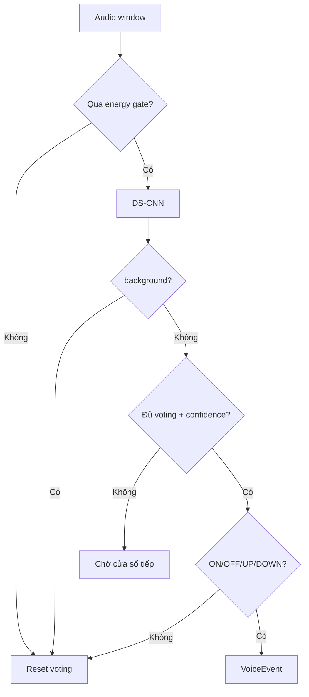

# Keyword Policy

## Bộ keyword cố định

Chỉ sử dụng bốn command đã có dữ liệu và model:

| Keyword | Vai trò chung |
| --- | --- |
| `ON` | Bật, mở, play hoặc bắt đầu |
| `OFF` | Tắt, đóng, pause hoặc kết thúc |
| `UP` | Tăng hoặc điều hướng tới mục kế |
| `DOWN` | Giảm hoặc điều hướng về mục trước |

`background` là lớp thứ năm của model nhưng không phải keyword. Runtime xóa
voting history khi dự đoán background và không tạo `VoiceEvent`.

## Vì sao không thêm keyword

- Không có dữ liệu/train cho `next`, `previous`, `play`, tên ứng dụng hoặc tên
  chức năng.
- Ép các từ mới vào bốn output cũ sẽ làm tăng false activation.
- Gesture đã đảm nhiệm chọn mode/target, nên bốn action là đủ cho MVP.
- Muốn thêm keyword phải quay lại Phase 1–4 và đánh giá confusion matrix mới.

## Safety gate

- Confidence KWS tối thiểu `0.70`.
- Voting ít nhất `2/4` prediction liên tiếp.
- Cooldown `1.5` giây sau một keyword được xác nhận.
- Action phải hợp capability của target.
- Panic dùng `right_ok`, không phụ thuộc KWS có thể nhận nhầm.
