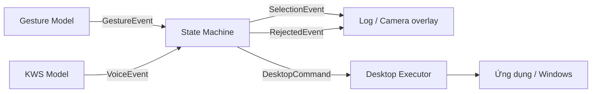
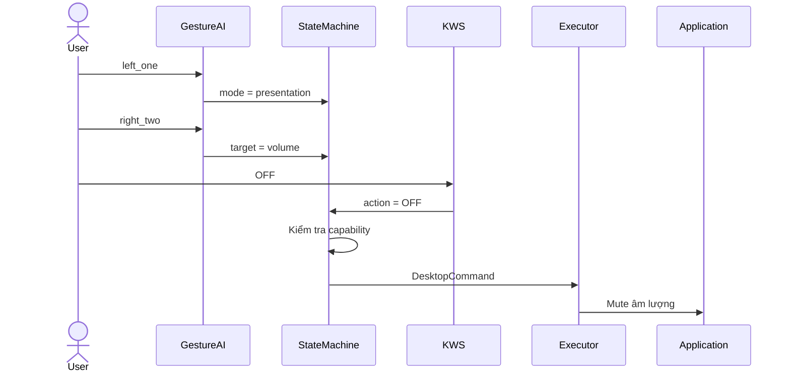
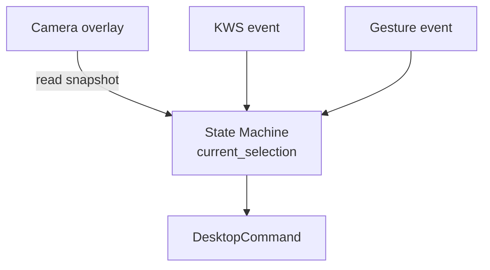
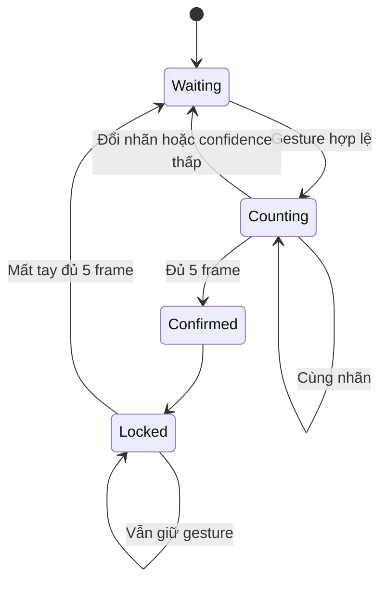
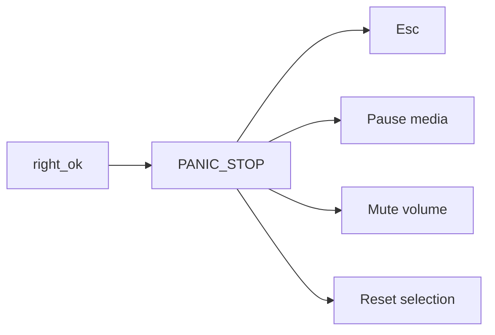
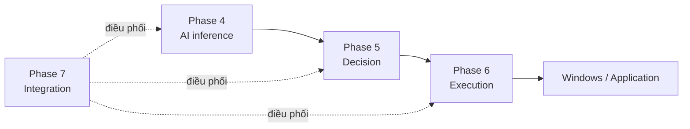

# Nguyên tắc thiết kế State Machine

> Đây là tài liệu cần đọc trước khi sửa State Machine, thay đổi mapping gesture–KWS hoặc bổ sung hành động điều khiển máy tính.

## 1. Vai trò của State Machine

Hai mô hình AI chỉ thực hiện nhận diện:

- Gesture Model nhận diện tư thế bàn tay.
- KWS Model nhận diện `ON`, `OFF`, `UP`, `DOWN` hoặc `background`.

Hai model không được trực tiếp gửi phím hoặc điều khiển ứng dụng.

State Machine chịu trách nhiệm:

1. Nhận kết quả gesture và KWS.
2. Giữ lựa chọn hiện tại của người dùng.
3. Ghép các kết quả thành một lệnh đầy đủ.
4. Kiểm tra tổ hợp có hợp lệ hay không.
5. Chỉ tạo `DesktopCommand` khi tất cả điều kiện đều hợp lệ.



## 2. Luồng điều khiển ba bước

Một lệnh desktop thông thường được tạo từ ba thành phần:

```text
Gesture tay trái + Gesture tay phải + KWS
      mode       +       target        + action
```

### Bước 1 — Tay trái chọn mode

```text
left_one → presentation
left_two → desktop_media
```

Mode xác định ngữ cảnh điều khiển.

Ví dụ `right_one` có thể mang ý nghĩa khác nhau tùy mode:

```text
presentation + right_one → slideshow
desktop_media + right_one → media
```

### Bước 2 — Tay phải chọn target

Gesture tay phải chọn chức năng cụ thể bên trong mode hiện tại.

Ví dụ:

```text
left_one + right_two
→ presentation + volume
```

Lúc này chưa có hành động nào được thực thi. State Machine mới chỉ lưu:

```python
{
    "mode": "presentation",
    "target": "volume",
}
```

### Bước 3 — KWS chọn action

KWS chỉ cung cấp một trong bốn action:

```text
ON
OFF
UP
DOWN
```

State Machine ghép action với selection hiện tại:

```text
presentation + volume + OFF
→ DesktopCommand
→ mute âm lượng toàn hệ thống
```



Ba bước được thực hiện tuần tự, không cần xuất hiện đồng thời.

## 3. Vì sao phải tách AI khỏi business logic?

AI chỉ nên trả lời câu hỏi nhận diện:

```text
Camera đang thấy gesture nào?
Microphone đang nghe thấy keyword nào?
```

AI không nên tự quyết định:

```text
Gesture này sẽ mở ứng dụng nào?
Keyword OFF sẽ đóng tab hay mute âm lượng?
Tổ hợp hiện tại có hợp lệ không?
```

Các quyết định đó thuộc State Machine.

### Lợi ích của việc tách riêng

- Có thể đổi mapping mà không train lại model.
- Có thể test State Machine mà không cần webcam hoặc microphone.
- Có thể thay Desktop Executor mà không sửa model.
- Tránh để một prediction AI đơn lẻ thao tác trực tiếp hệ điều hành.
- Dễ ghi log và giải thích nguyên nhân lệnh bị từ chối.
- Dễ thêm mode hoặc target trong tương lai.

Kiến trúc đúng:

```text
AI inference
→ event chuẩn hóa
→ State Machine
→ command đã validate
→ Desktop Executor
```

Kiến trúc không nên dùng:

```text
Model dự đoán gesture
→ gửi phím trực tiếp vào Windows
```

## 4. Một nguồn state duy nhất

State Machine giữ selection trong một cấu trúc duy nhất:

```python
current_selection = {
    "mode": None,
    "target": None,
    "last_updated": None,
}
```

Ý nghĩa:

- `mode`: chế độ được chọn bởi tay trái.
- `target`: chức năng được chọn bởi tay phải.
- `last_updated`: thời điểm cập nhật gần nhất.

Không lưu thêm bản sao selection trong:

- Gesture Model.
- KWS Model.
- Desktop Executor.
- Camera overlay.
- Log runtime.

Các thành phần khác chỉ được đọc snapshot từ State Machine.



## 5. Quy tắc khi đổi mode

Khi tay trái chọn mode mới, target cũ phải bị xóa.

Ví dụ, state hiện tại là:

```text
mode   = desktop_media
target = media
```

Người dùng tiếp tục chọn:

```text
left_one → presentation
```

State mới phải là:

```text
mode   = presentation
target = None
```

Không được giữ lại `media`, vì target đó thuộc mode trước.

Nếu không xóa target cũ, keyword tiếp theo có thể tạo command sai ngữ cảnh.

## 6. Gesture debounce

Camera tạo nhiều frame mỗi giây. Nếu mỗi frame đều phát event thì một lần giữ tay có thể tạo hàng chục selection.

Vì vậy gesture chỉ được xác nhận khi:

- Confidence đạt ít nhất `0.70`.
- Cùng một nhãn ổn định trong `5` frame.
- Khoảng cách giữa hai frame không vượt `0.25` giây.



## 7. Gesture release lock

Sau khi một gesture được xác nhận, nhãn đó bị khóa.

Ví dụ:

```text
left_one được xác nhận
→ phát một SelectionEvent
→ người dùng vẫn giữ left_one
→ không phát thêm event
```

Gesture chỉ được phép kích hoạt lại sau khi:

```text
tay biến mất đủ 5 frame
```

Quy tắc này ngăn selection bị phát lặp liên tục.

## 8. Handedness validation

Tay trái và tay phải có nhiệm vụ khác nhau:

```text
Tay trái → mode
Tay phải → target hoặc panic
```

Nếu MediaPipe xác định tay phải nhưng model trả về `left_one`, event phải bị từ chối.

Ví dụ không hợp lệ:

```text
hand  = Right
label = left_one
```

Điều này giúp tránh sử dụng nhãn thuộc sai nhóm tay.

## 9. Selection timeout

Mode và target không được giữ vô thời hạn.

Selection hết hạn sau:

```text
12 giây
```

Ví dụ:

```text
Người dùng chọn presentation + volume
→ không nói gì trong 12 giây
→ selection bị reset
→ keyword nói sau đó bị từ chối
```

State sau timeout:

```python
{
    "mode": None,
    "target": None,
    "last_updated": None,
}
```

Lý do:

- Tránh keyword tác động lên lựa chọn cũ.
- Tránh người dùng quên target đang được chọn.
- Giảm nguy cơ kích hoạt ngoài ý muốn.

## 10. Capability validation

Không phải target nào cũng hỗ trợ cả bốn action.

Ví dụ:

```text
volume        → ON, OFF, UP, DOWN
browser_scroll → UP, DOWN
fullscreen    → ON, OFF
profile       → ON, OFF
```

State Machine phải kiểm tra:

```python
action in CAPABILITIES[mode][target]
```

Nếu không hợp lệ:

```text
→ RejectedEvent(reason="action_not_supported")
→ không tạo DesktopCommand
→ không gọi Desktop Executor
```

Ví dụ:

```text
left_two + right_three + ON
→ desktop_media + browser_scroll + ON
→ bị từ chối
```

Vì `browser_scroll` chỉ hỗ trợ `UP` và `DOWN`.

## 11. KWS chỉ có bốn command

Bốn keyword được phép:

```text
ON
OFF
UP
DOWN
```

`background` là lớp chống nhiễu, không phải command.

Không được tự ý thêm:

```text
NEXT
PREVIOUS
PLAY
PAUSE
OPEN
CLOSE
```

nếu chưa quay lại các Phase:

```text
thu dữ liệu
→ tiền xử lý
→ train lại
→ đánh giá lại
```

Ý nghĩa như `next`, `previous`, `play` hoặc `pause` được tạo ở tầng mapping:

```text
media + UP   → next track
media + DOWN → previous track
media + ON   → play
media + OFF  → pause
```

## 12. KWS voting và cooldown

Một prediction KWS đơn lẻ chưa đủ để tạo `VoiceEvent`.

Runtime dùng:

- Energy gate.
- VAD.
- Confidence threshold.
- Voting các prediction liên tiếp.
- Cooldown sau khi xác nhận keyword.

Thông số hiện tại:

```text
Confidence tối thiểu: 0.70
Voting: ít nhất 2 prediction liên tiếp
Voting window: tối đa 4 prediction
Cooldown: 1.5 giây
```

Vai trò:

```text
Energy gate → loại im lặng
VAD         → lấy vùng có tiếng nói
Background  → loại âm thanh không phải command
Voting      → giảm nhãn nhảy
Cooldown    → tránh nhận lại cùng một lần phát âm
```

## 13. Command dedup

Sau khi KWS tạo `VoiceEvent`, State Machine còn một lớp chống lặp riêng.

Hai command có cùng chữ ký:

```text
command_type
mode
target
action
```

và xuất hiện trong vòng:

```text
0.75 giây
```

thì command thứ hai bị loại.

KWS cooldown và State Machine dedup có vai trò khác nhau:

```text
KWS cooldown
→ chống nhận lại cùng đoạn âm thanh

State Machine dedup
→ chống phát lại cùng command
```

Không nên bỏ một trong hai chỉ vì chúng có vẻ giống nhau.

## 14. Panic độc lập với KWS

`right_ok` là gesture đặc biệt:

```text
right_ok → PANIC_STOP
```

Panic không yêu cầu:

- Mode.
- Target.
- Keyword.
- Selection đang tồn tại.

Panic thực hiện:

```text
Esc
→ pause media
→ mute volume
→ reset selection
```



Lý do panic không dùng KWS:

- KWS có thể nhận sai trong môi trường ồn.
- Lệnh dừng phải thực hiện nhanh.
- Người dùng không nên làm đủ ba bước khi cần dừng khẩn cấp.

Panic không được thực hiện các hành động destructive như:

- Shutdown.
- Logout.
- Xóa file.
- Đóng cưỡng bức ứng dụng.
- Kill process.

## 15. Ba loại output của State Machine

### SelectionEvent

Được tạo khi mode hoặc target thay đổi:

```python
{
    "event_type": "SELECTION",
    "mode": "presentation",
    "target": "volume",
    "gesture": "right_two",
    "timestamp": 123.0,
}
```

SelectionEvent chỉ dùng để:

- Hiển thị log.
- Cập nhật overlay.
- Cho người dùng biết bước tiếp theo.

Nó không được gửi tới executor.

### RejectedEvent

Được tạo khi thao tác không hợp lệ:

```python
{
    "event_type": "REJECTED",
    "source": "voice",
    "reason": "action_not_supported",
    "timestamp": 124.0,
}
```

RejectedEvent không được thực thi.

### DesktopCommand

Chỉ được tạo khi mode, target và action đều hợp lệ:

```python
{
    "event_type": "DESKTOP_COMMAND",
    "command_type": "DESKTOP_ACTION",
    "mode": "presentation",
    "target": "volume",
    "action": "OFF",
    "source": "gesture_voice",
    "timestamp": 125.0,
}
```

Chỉ `DesktopCommand` mới được chuyển sang Phase 6.

## 16. Ranh giới Phase 5, Phase 6 và Phase 7

### Phase 5 — Desktop State Machine

Trách nhiệm:

- Debounce gesture.
- Giữ mode và target.
- Timeout selection.
- Ghép KWS action.
- Validate capability.
- Deduplicate command.
- Tạo event.

Không được:

- Mở camera.
- Thu microphone.
- Gửi hotkey.
- Chỉnh volume hoặc brightness.
- Điều khiển ứng dụng.

### Phase 6 — Desktop Action Executor

Trách nhiệm:

- Nhận `DesktopCommand`.
- Map command sang primitive action.
- Thực hiện hotkey hoặc Windows API.
- Hỗ trợ dry-run.
- Trả kết quả thực thi.

Không được:

- Tự suy luận gesture.
- Tự nhận diện keyword.
- Tự chọn mode hoặc target.
- Bỏ qua capability của State Machine.

### Phase 7 — System Integration

Trách nhiệm:

- Mở webcam và microphone.
- Load hai model.
- Tạo `GestureEvent` và `VoiceEvent`.
- Gọi State Machine.
- Chuyển `DesktopCommand` sang Executor.
- Hiển thị overlay và log.



## 17. Dry-run và execute

Runtime mặc định chạy dry-run:

```powershell
python P7_System_Integration/Desktop_Runtime.py
```

Trong chế độ này:

- Webcam và microphone hoạt động thật.
- AI inference hoạt động thật.
- State Machine hoạt động thật.
- Executor chỉ in action dự kiến.
- Không gửi thao tác vào Windows.

Thao tác thật chỉ được bật khi có:

```powershell
python P7_System_Integration/Desktop_Runtime.py --execute
```

Dry-run phải được kiểm tra trước khi:

- Thêm mapping mới.
- Thay đổi capability.
- Thay đổi timeout.
- Sửa executor.
- Demo trên máy tính khác.

## 18. Log luồng ba bước

Runtime phải thể hiện rõ tiến trình:

```text
[FLOW 1/3] left_one -> mode=presentation
[NEXT] Giơ gesture tay phải để chọn chức năng.

[FLOW 2/3] left_one + right_two -> target=volume
[NEXT] Nói keyword hợp lệ: ON/OFF/UP/DOWN

[KWS] keyword=OFF | confidence=88.0%

[FLOW 3/3] left_one + right_two + OFF
[COMMAND] mode=presentation | target=volume | action=OFF
[ACTION] Tắt tiếng toàn hệ thống; media vẫn tiếp tục phát
[RESULT/DRY-RUN] CHỈ MÔ PHỎNG
```

Log phải trả lời được:

1. Người dùng vừa thực hiện gesture nào?
2. Mode hiện tại là gì?
3. Target hiện tại là gì?
4. Keyword vừa nhận diện là gì?
5. Tổ hợp hoàn chỉnh là gì?
6. Hành động dự kiến là gì?
7. Hành động đã thực thi hay mới dry-run?
8. Nếu thất bại thì lý do là gì?

## 19. Quy tắc khi thêm mapping mới

Trước khi thêm mapping, phải xác định:

1. Mapping thuộc mode nào?
2. Gesture tay phải nào chọn target?
3. Target hỗ trợ action nào?
4. Mỗi action tạo thao tác Windows nào?
5. Thao tác có phụ thuộc cửa sổ active không?
6. Có khả năng gây mất dữ liệu không?
7. Panic có dừng được thao tác đó không?
8. Test dry-run cần bổ sung trường hợp nào?

Các vị trí thường phải cập nhật:

```text
P5_Desktop_State_Machine/State_Machine_Core.py
P5_Desktop_State_Machine/Test_State_Machine.py
P6_Desktop_Action_Executor/Desktop_Action_Executor.py
P6_Desktop_Action_Executor/Test_Desktop_Executor.py
P7_System_Integration/Test_System_Integration.py
Docs/Design/Gesture_KWS_Mapping.md
```

Không thêm mapping trực tiếp trong runtime nếu mapping đó thuộc business logic.

## 20. Quy tắc kiểm thử

Thứ tự kiểm thử:

```text
State Machine unit test
→ Executor dry-run test
→ Integration test bằng event giả
→ Load model
→ Runtime dry-run
→ Runtime execute
```

Các lệnh kiểm thử:

```powershell
python P5_Desktop_State_Machine/Test_State_Machine.py
python P6_Desktop_Action_Executor/Test_Desktop_Executor.py
python P7_System_Integration/Test_System_Integration.py
python P7_System_Integration/Desktop_Runtime.py --check-models
python P7_System_Integration/Desktop_Runtime.py
python P7_System_Integration/Desktop_Runtime.py --execute
```

Test tự động không được gửi thao tác thật vào hệ điều hành.

## 21. Kết luận

Nguyên tắc cốt lõi của hệ thống là:

```text
AI nhận diện
→ State Machine quyết định
→ Executor thực thi
```

Và một lệnh thông thường luôn tuân theo:

```text
mode + target + action
```

Trong đó:

```text
tay trái → mode
tay phải → target
KWS      → action
```

Không để AI thao tác trực tiếp hệ điều hành. Không để Executor tự suy luận selection. Không thực thi tổ hợp chưa qua capability validation. Đây là ranh giới quan trọng nhất cần giữ khi mở rộng dự án.