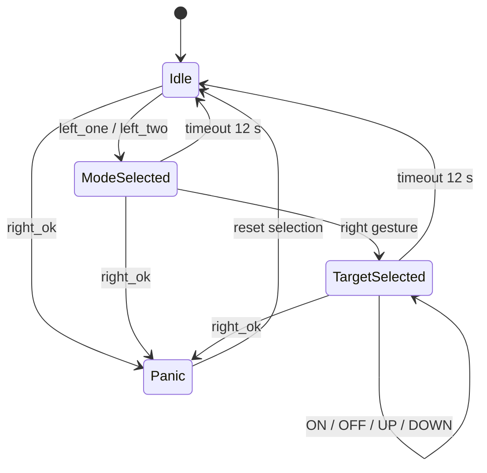

# Phase 5 — Desktop State Machine

## Mục tiêu

Ghép gesture đã debounce với một trong bốn KWS action thành `DesktopCommand`.
Core không mở webcam/micro và không gửi phím vào hệ điều hành.

Phase 5 chính là nơi **điều khiển luồng kết hợp**:

```text
left gesture  -> lưu mode
right gesture -> lưu target
KWS           -> action
mode + target + action -> DesktopCommand
```

Phase 5 chỉ quyết định lệnh nào hợp lệ. Phase 6 mới biến lệnh đó thành hotkey
hoặc Windows API, còn Phase 7 vận hành toàn bộ camera + micro theo thời gian thực.



## Quy tắc

- Gesture confidence tối thiểu `0.70`.
- Gesture ổn định `5` frame mới được chốt.
- Selection hết hạn sau `12` giây.
- Command giống nhau trong `0.75` giây bị loại.
- `right_ok` tạo `PANIC_STOP` ngay, không chờ keyword.
- KWS ngoài `ON/OFF/UP/DOWN` không được nhận.
- Action không hợp capability tạo `RejectedEvent`, không chuyển sang Phase 6.

## File

- `State_Machine_Core.py`: logic thuần và mapping capability.
- `Test_State_Machine.py`: kiểm thử offline `25/25 PASS`.

```powershell
.\venv\Scripts\python.exe .\P5_Desktop_State_Machine\Test_State_Machine.py
```

Danh sách mọi tổ hợp hợp lệ nằm tại
[Gesture_KWS_Mapping.md](../Design/Gesture_KWS_Mapping.md).
