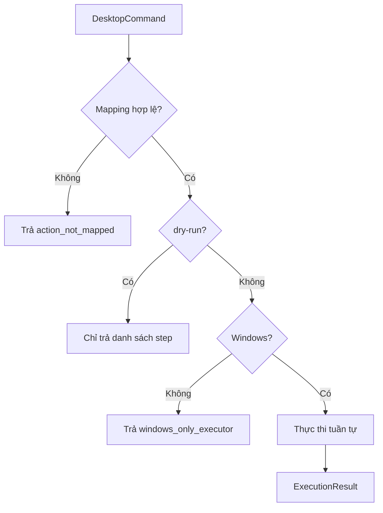

# Phase 6 — Desktop Action Executor

## Mục tiêu

Chuyển `DesktopCommand` đã validate thành phím tắt, media command, thao tác cửa
sổ hoặc lệnh chỉnh brightness trên Windows.



## Nguyên tắc an toàn

- `Execute_Command(..., dry_run=True)` là mặc định.
- Test không gửi bất kỳ phím hoặc Windows API nào.
- Runtime chỉ thực thi thật khi có cờ `--execute`.
- Command không map được bị từ chối trước khi gọi hệ điều hành.
- Panic chỉ `Esc`, pause media và mute volume; không shutdown, logout hay xóa dữ liệu.
- Media/volume dùng `PostMessageW` bất đồng bộ để camera loop không phải chờ
  các cửa sổ Windows xử lý broadcast message.

## Hạn chế nền tảng

- Thao tác thật chỉ hỗ trợ Windows.
- Hotkey tác động lên ứng dụng đang active.
- Brightness WMI có thể không hỗ trợ màn hình rời.
- `volume OFF` dùng chuỗi volume-up rồi mute để tránh toggle sai trạng thái.

## Kiểm thử

```powershell
.\venv\Scripts\python.exe .\P6_Desktop_Action_Executor\Test_Desktop_Executor.py
```

Kết quả hiện tại: `19/19 PASS`.
