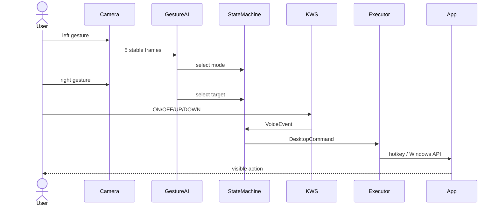

# Phase 7 — System Integration

## Mục tiêu

Tạo một entry point duy nhất nối webcam, micro, hai model, State Machine và
Desktop Executor.



## Entry point

```powershell
# Chỉ kiểm tra model
.\venv\Scripts\python.exe .\P7_System_Integration\Desktop_Runtime.py --check-models

# Nhận diện thật, không thao tác hệ điều hành
.\venv\Scripts\python.exe .\P7_System_Integration\Desktop_Runtime.py

# Nhận diện và thao tác thật
.\venv\Scripts\python.exe .\P7_System_Integration\Desktop_Runtime.py --execute
```

Runtime đo noise nền trong hai giây, giữ energy gate, VAD, spectral denoise,
voting và cooldown của Phase 4. OpenCV chỉ hiển thị preview/debug, không phải
dashboard.

## Kiểm thử tích hợp

`Test_System_Integration.py` phát event giả từ gesture đến executor dry-run.
Kết quả hiện tại: `5/5 PASS`.
