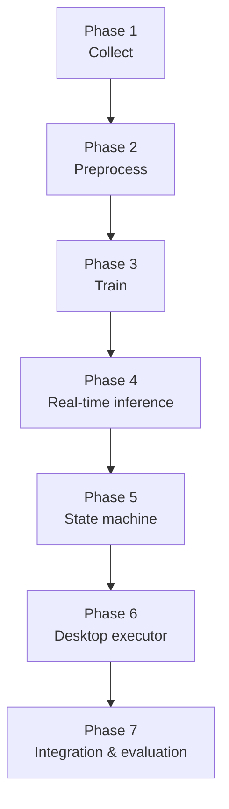

# Tài liệu GestureVoice Desktop Controller

## Theo Phase

- [Phase 1](Phase/Phase_1.md): Data Collection.
- [Phase 2](Phase/Phase_2.md): Data Preprocessing.
- [Phase 3](Phase/Phase_3.md): Model Training.
- [Phase 4](Phase/Phase_4.md): Real-time Evaluation.
- [Phase 5](Phase/Phase_5.md): Desktop State Machine.
- [Phase 6](Phase/Phase_6.md): Desktop Action Executor.
- [Phase 7](Phase/Phase_7.md): System Integration.

## Thiết kế và vận hành

- [Gesture + KWS Mapping](Design/Gesture_KWS_Mapping.md).
- [Keyword Policy](Design/Keyword_Policy.md).
- [Runtime Architecture](Workflow/Desktop_Runtime.md).
- [Test Plan](Testing/Test_Plan.md).

