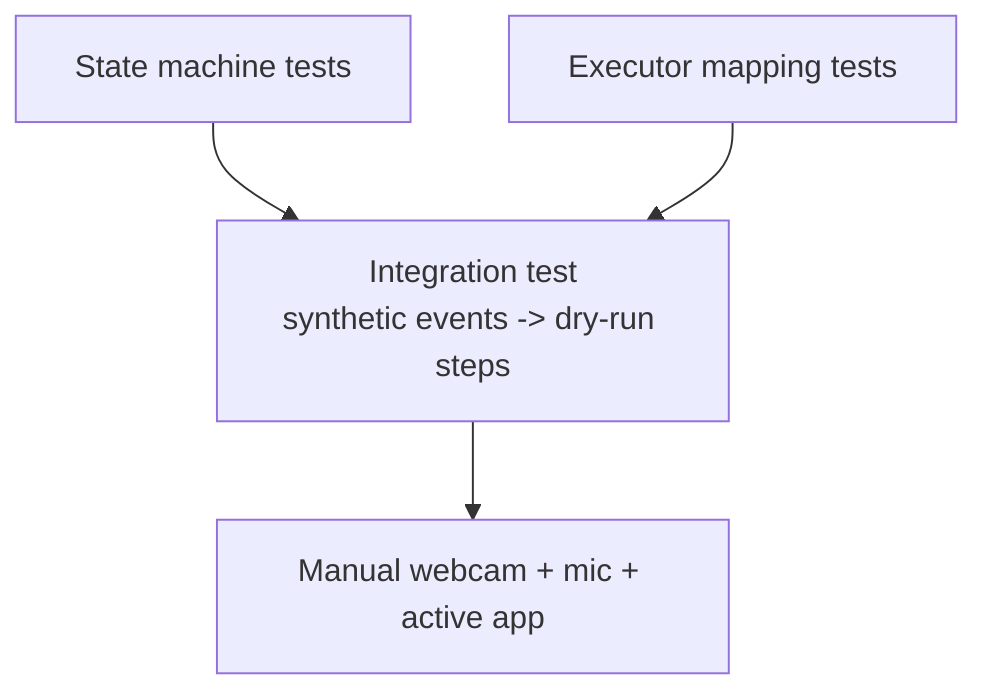

# Test Plan

## Kim tự tháp kiểm thử



## Test tự động

```powershell
.\venv\Scripts\python.exe .\P5_Desktop_State_Machine\Test_State_Machine.py
.\venv\Scripts\python.exe .\P6_Desktop_Action_Executor\Test_Desktop_Executor.py
.\venv\Scripts\python.exe .\P7_System_Integration\Test_System_Integration.py
.\venv\Scripts\python.exe .\P7_System_Integration\Desktop_Runtime.py --check-models
```

Test Phase 6 và Phase 7 luôn dùng dry-run, do đó không đổi tab, volume,
brightness hoặc cửa sổ trong lúc test.

## Test thủ công đề xuất

1. Chạy runtime không có `--execute`, kiểm tra mapping trên console.
2. Thử từng gesture dưới ba điều kiện ánh sáng và hai khoảng cách.
3. Nói riêng từng keyword ít nhất 20 lần; ghi false accept và false reject.
4. Bật `--execute`, đặt đúng ứng dụng làm cửa sổ active.
5. Kiểm tra Presentation, Media, Browser và Window theo mapping.
6. Thử `right_ok` khi chưa chọn mode và khi selection đang tồn tại.
7. Ghi latency từ khi kết thúc phát âm tới khi ứng dụng phản hồi.

Tiêu chí MVP: không có command ngoài capability, panic luôn hoạt động, và mọi
thao tác destructive như shutdown, logout, xóa file đều không tồn tại trong mapping.
