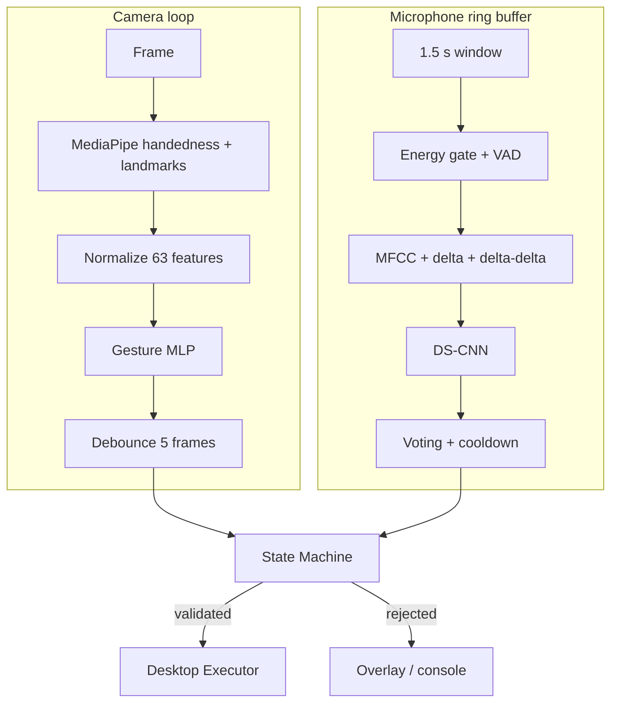

# Workflow — Desktop Runtime

## Pipeline song song



Camera là main loop. Audio callback chỉ ghi vào ring buffer; việc predict KWS
được poll mỗi `0.1` giây để tránh block callback. Tất cả timestamp dùng
`time.monotonic()` nhằm giữ debounce, timeout và cooldown ổn định.

## Chế độ chạy

| Cờ | Camera/micro | Inference | OS action |
| --- | --- | --- | --- |
| `--check-models` | Không | Chỉ load model | Không |
| Không có cờ | Có | Có | Dry-run |
| `--execute` | Có | Có | Có |

Dry-run là đường kiểm tra bắt buộc trước khi bật `--execute` trong môi trường
mới hoặc sau khi đổi mapping.

## Log luồng ba bước

Runtime in ý nghĩa thao tác thay vì chỉ in dictionary kỹ thuật. Ví dụ:

```text
[FLOW 1/3] left_one -> mode=presentation
[NEXT] Giơ gesture tay phải để chọn chức năng.
[FLOW 2/3] left_one + right_two -> target=volume
[NEXT] Nói keyword hợp lệ cho target này: ON/OFF/UP/DOWN
[KWS] keyword=OFF | confidence=88.0%
[FLOW 3/3] left_one + right_two + OFF
[COMMAND] mode=presentation | target=volume | action=OFF
[ACTION] Tắt tiếng toàn hệ thống; media vẫn tiếp tục phát
[RESULT/DRY-RUN] CHỈ MÔ PHỎNG | steps: volume_up -> volume_mute
```

Khi chạy với `--execute`, dòng cuối đổi thành `RESULT/EXECUTE` và
`ĐÃ THỰC THI`. Nếu executor lỗi, log ghi rõ `reason` và `error`.
