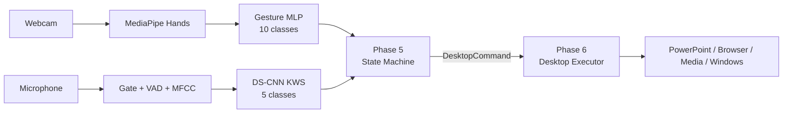

# GestureVoice Desktop Controller

**GestureVoice Desktop Controller** điều khiển ứng dụng trên máy tính bằng
gesture + Keyword Spotting.
Hệ thống chạy cục bộ trên Windows, không dùng MQTT, ESP32 hoặc dashboard.

## Kiến trúc



Gesture chọn `mode` và `target`; KWS chỉ chọn một trong bốn action
`ON/OFF/UP/DOWN`. Lớp `background` chỉ chặn nhiễu, không phải command.

## Các Phase

| Phase | Nội dung | Trạng thái |
| --- | --- | --- |
| 1 | Thu thập gesture và KWS dataset | Hoàn thành |
| 2 | Tiền xử lý landmark và MFCC | Hoàn thành |
| 3 | Train MLP gesture và DS-CNN KWS | Hoàn thành |
| 4 | Đánh giá webcam/micro real-time | Hoàn thành |
| 5 | Desktop State Machine | Hoàn thành, `25/25 PASS` |
| 6 | Desktop Action Executor | Hoàn thành, `19/19 PASS` |
| 7 | Tích hợp end-to-end | Hoàn thành, `5/5 PASS` |

## Mapping ngắn

- `left_one`: Presentation mode.
- `left_two`: Desktop/Media mode.
- Tay phải chọn chức năng theo mode.
- `right_like`: profile macro.
- `right_ok`: panic stop ngay, không cần voice.
- Voice command duy nhất: `ON`, `OFF`, `UP`, `DOWN`.

Mapping đầy đủ: [Gesture_KWS_Mapping.md](Docs/Design/Gesture_KWS_Mapping.md).

## Chạy dự án

### 1. Kiểm tra offline

```powershell
.\venv\Scripts\python.exe .\P5_Desktop_State_Machine\Test_State_Machine.py
.\venv\Scripts\python.exe .\P6_Desktop_Action_Executor\Test_Desktop_Executor.py
.\venv\Scripts\python.exe .\P7_System_Integration\Test_System_Integration.py
.\venv\Scripts\python.exe .\P7_System_Integration\Desktop_Runtime.py --check-models
```

### 2. Chạy an toàn ở dry-run

```powershell
.\venv\Scripts\python.exe .\P7_System_Integration\Desktop_Runtime.py
```

Camera và micro vẫn nhận diện thật, nhưng executor chỉ in các phím/API dự kiến.

### 3. Cho phép thao tác thật

```powershell
.\venv\Scripts\python.exe .\P7_System_Integration\Desktop_Runtime.py --execute
```

Phím tắt browser/slideshow tác động lên cửa sổ đang active. Brightness dùng WMI
và thường chỉ hỗ trợ màn hình tích hợp của laptop. Nhấn `q` để thoát runtime.

## Kết quả model hiện tại

- Gesture MLP: 10 lớp, test accuracy `99.00%`.
- KWS DS-CNN: 5 lớp, test accuracy `95.76%`.
- KWS cần tiếp tục theo dõi nhầm lẫn `off -> up` trong môi trường thật.

## Cấu trúc

```text
GestureVoice-Desktop-Controller/
├── P1_Data_Collection/
├── P2_Data_Preprocessing/
├── P3_Train_Model/
├── P4_Real_Time_Evaluation/
├── P5_Desktop_State_Machine/
├── P6_Desktop_Action_Executor/
├── P7_System_Integration/
├── Docs/
├── requirements.txt
└── README.md
```

Tài liệu kiến trúc và cách kiểm thử nằm trong [Docs](Docs/README.md).

## Tác giả / Author
- Tên: **Nguyễn Ngọc Chiến.** 
- Mã sinh viên: **B23DCVT061**
- Sinh viên: **Học viện Công Nghệ Bưu Chính Viễn Thông.**

Nếu bạn có bất kỳ câu hỏi nào hoặc thấy dự án này hữu ích, đừng ngần ngại mở một Issue hoặc cho repo một ⭐ nhé!

## License
Dự án này được phân phối dưới giấy phép MIT. Xem file [LICENSE](LICENSE) để biết thêm chi tiết.